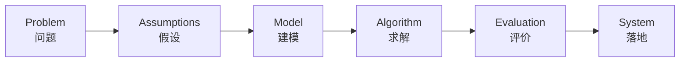

<h1>👋 Hi, I'm Weidong Lang / 你好，我是郎卫东</h1>

<h3>Software Development · Mathematical Modeling · AI Search · Engineering Practice</h3>

 

 
 

---

## 🧭 About Me

我是一名关注 **软件开发、数学建模与交叉工程实践** 的本科生，喜欢把真实场景中的复杂问题抽象为模型，并通过算法、数据和软件系统实现落地。

> Undergraduate developer focused on software development, mathematical modeling, AI search, and engineering-oriented system design.

* 🔭 目前关注：全栈开发、AI 检索、RAG 应用、推荐系统、数据可视化
* 📐 建模方向：优化建模、统计分析、评价模型、调度问题、工程决策支持
* 🛩️ 场景兴趣：低空经济、无人机调度、时空资源协同、工程平台设计
* 🚀 目标：把算法能力、建模思维和工程系统结合起来

---

## 🛠 Tech Stack

---

## 📐 Mathematical Modeling

| Direction               | Methods                                                               |
| ----------------------- | --------------------------------------------------------------------- |
| Optimization Modeling   | Linear Programming, Integer Programming, Multi-objective Optimization |
| Statistical Analysis    | Regression, Correlation Analysis, Hypothesis Testing                  |
| Evaluation Models       | AHP, Entropy Weight Method, TOPSIS                                    |
| Prediction & Simulation | Time Series, Grey Forecasting, Monte Carlo Simulation                 |
| Graph & Scheduling      | Shortest Path, Network Flow, Route Planning, UAV Scheduling           |

| Scenario            | Formula                                                    |
| ------------------- | ---------------------------------------------------------- |
| Optimization        | $\min f(x), \quad x \in \Omega$                            |
| Weighted Evaluation | $S_i = \sum_{j=1}^{n} w_j x_{ij}$                          |
| Prediction Error    | $RMSE = \sqrt{\frac{1}{n}\sum_{i=1}^{n}(y_i-\hat{y}_i)^2}$ |
| Vector Similarity   | $\cos(\theta)=\frac{A \cdot B}{|A||B|}$                    |

---

## 🚀 Featured Projects

<table>
<tr>
<td width="50%">

### 📚 [ReadSeek](https://github.com/weidonglang/ReadSeek-Reading-Resource-Discovery-System)

阅读资源发现系统，支持混合检索、向量召回、重排序、基于证据的 RAG 问答、可解释推荐与用户行为分析。

**Keywords:** `Spring Boot` · `RAG` · `Hybrid Search` · `Recommendation` · `Redis` · `Elasticsearch`

</td>
<td width="50%">

### 🎓 [Academic Nexus](https://github.com/weidonglang/Academic-Nexus)

全栈教务管理平台原型，包含选课、权限管理、后端服务、数据库设计、压力测试与数据可视化。

**Keywords:** `Java` · `Spring Boot` · `Vue 3` · `MySQL` · `Redis` · `Full-Stack`

</td>
</tr>

<tr>
<td width="50%">

### 🛩️ [SkyGrid Low-Altitude Platform](https://github.com/weidonglang/SkyGrid-Low-Altitude-Platform)

面向无人机巡检与低空航线预约场景的低空时空资源协同调度平台，支持空域网格建模、预约审批、冲突检测与审计留痕。

**Keywords:** `Low-Altitude Economy` · `UAV Scheduling` · `Spatiotemporal Modeling` · `Visualization`

</td>
<td width="50%">

### 🧭 [LowAlt RouteLab](https://github.com/weidonglang/LowAlt-RouteLab)

低空航路与调度实验项目，用于探索路线规划、场景建模、算法验证与调度策略分析。

**Keywords:** `Python` · `Route Planning` · `Simulation` · `Algorithm Validation`

</td>
</tr>
</table>

---

## 📊 GitHub Analytics

 

---

## 📈 Profile Summary

 
 

---

## 🎯 Current Focus

<table>
<tr>
<td width="50%">

### Engineering Development

* Spring Boot backend architecture
* Vue 3 frontend development
* MySQL / Redis / PostgreSQL
* RESTful API design
* System testing and performance optimization

</td>
<td width="50%">

### Modeling & Intelligence

* Hybrid retrieval and reranking
* Evidence-grounded RAG systems
* Explainable recommendation
* Optimization and scheduling
* Data visualization and decision support

</td>
</tr>
</table>

---

🌍 English Profile

I am an undergraduate developer interested in software development, mathematical modeling, AI search, and interdisciplinary engineering.

My work focuses on connecting algorithms, data, and engineering systems. I enjoy designing full-stack platforms, building retrieval-augmented applications, and modeling real-world problems such as scheduling, resource coordination, and decision support.

---

 
 

### Thanks for visiting! / 感谢访问！

