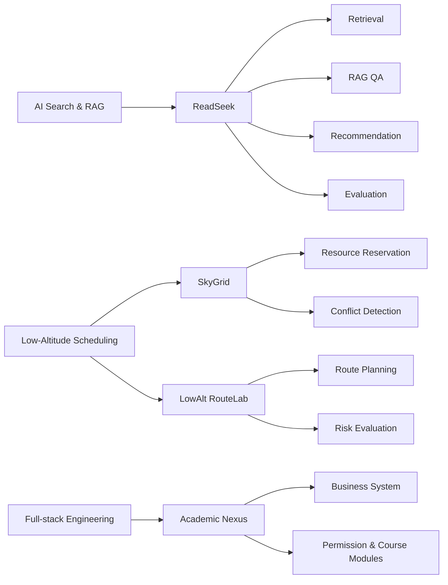

<div align="center">


<h1>👋 Hi, I'm Weidong Lang / 你好，我是魏冬琅</h1>

<h3>AI Search · RAG Systems · Mathematical Modeling · Full-stack Engineering</h3>

<p>
  
  
  
  
</p>

</div>

---

## 🧭 About Me

我是一名关注 **AI 检索、RAG 应用、数学建模与工程系统落地** 的本科生，喜欢把真实场景中的复杂问题抽象为模型，并通过算法、数据和软件系统实现可用、可解释、可迭代的解决方案。

> Undergraduate developer focused on AI search, RAG systems, mathematical modeling, and engineering-oriented full-stack platforms.

我目前的技术主线可以概括为：

```text
AI Search / RAG + Mathematical Modeling + Engineering Systems
```

- 🔍 **AI Search & RAG**：混合检索、向量召回、重排序、基于证据的问答、推荐系统
- 📐 **Mathematical Modeling**：优化建模、评价模型、调度问题、仿真实验、决策支持
- 🛠️ **Engineering Systems**：Spring Boot 后端、Vue 前端、数据库设计、缓存、搜索服务、可视化平台
- 🛩️ **Scenario Focus**：低空经济、无人机调度、时空资源协同、低空航路规划

---

## 🚀 Flagship Projects

<table>
<tr>
<td width="50%" valign="top">

<h3>
<a href="https://github.com/weidonglang/ReadSeek-Reading-Resource-Discovery-System">
📚 ReadSeek — AI Reading Resource Discovery System
</a>
</h3>

<p>
一个面向阅读资源发现的全栈 AI 检索系统，融合图书管理、混合检索、向量召回、重排序、基于证据的 RAG 问答、可解释推荐、用户行为分析与离线评测。
</p>

<p>
<b>Highlights</b>
</p>

<ul>
<li>Exact / BM25 / Vector / Hybrid / Hybrid + Reranker 多路检索链路</li>
<li>BGE-M3 向量召回与 BGE Reranker 重排序</li>
<li>基于馆藏证据的 RAG 问答，降低无依据生成</li>
<li>支持检索评测、RAG 评测、推荐评测与报告导出</li>
<li>包含 Rust CLI 离线评测工具，支持 Markdown / CSV / JSON / HTML 报告</li>
</ul>

<p>
<code>Spring Boot</code> · <code>PostgreSQL</code> · <code>Elasticsearch</code> · <code>Redis</code> · <code>Vue</code> · <code>RAG</code> · <code>Recommendation</code>
</p>

<p>


</p>

</td>
<td width="50%" valign="top">

<h3>
<a href="https://github.com/weidonglang/SkyGrid-Low-Altitude-Platform">
🛩️ SkyGrid — Low-Altitude Resource Scheduling Platform
</a>
</h3>

<p>
面向无人机巡检与低空航线预约场景的低空时空资源协同调度平台，关注空域资源建模、预约审批、冲突检测、审计留痕与工程可视化。
</p>

<p>
<b>Highlights</b>
</p>

<ul>
<li>面向低空经济场景的资源预约与调度平台原型</li>
<li>围绕空域网格、时间片、航线申请与冲突检测构建业务闭环</li>
<li>支持面向管理端的审批、查询、统计与可视化能力</li>
<li>体现工程系统、调度建模与场景化产品设计能力</li>
</ul>

<p>
<code>Low-Altitude Economy</code> · <code>UAV Scheduling</code> · <code>Spatiotemporal Modeling</code> · <code>Conflict Detection</code> · <code>Visualization</code>
</p>

<p>


</p>

</td>
</tr>

<tr>
<td width="50%" valign="top">

<h3>
<a href="https://github.com/weidonglang/LowAlt-RouteLab">
🧭 LowAlt RouteLab — UAV Route Planning Lab
</a>
</h3>

<p>
低空航路规划与风险评估实验项目，用于探索城市低空场景下的网格建模、航路规划、风险评分、能耗估计与调度冲突校验。
</p>

<p>
<b>Highlights</b>
</p>

<ul>
<li>基于 <code>Grid + Level + TimeSlot</code> 的低空时空建模思路</li>
<li>支持路径规划、风险评估、能耗估计与仿真实验</li>
<li>可与 SkyGrid 平台形成“算法实验 → 调度平台”的项目组合</li>
<li>适合用于算法验证、建模展示和低空场景原型研究</li>
</ul>

<p>
<code>Python</code> · <code>Route Planning</code> · <code>A*</code> · <code>Theta*</code> · <code>Simulation</code> · <code>Risk Evaluation</code>
</p>

<p>


</p>

</td>
<td width="50%" valign="top">

<h3>
<a href="https://github.com/weidonglang/Academic-Nexus">
🎓 Academic Nexus — Full-stack Academic Management Platform
</a>
</h3>

<p>
全栈教务管理平台原型，覆盖课程、选课、权限管理、后端服务、数据库设计、缓存、压力测试与数据可视化，用于展示完整 Web 系统工程能力。
</p>

<p>
<b>Highlights</b>
</p>

<ul>
<li>围绕教务场景构建前后端分离系统</li>
<li>包含权限、课程、选课、数据服务等典型业务模块</li>
<li>引入 Redis、接口测试与压力测试思路</li>
<li>作为全栈工程能力与业务系统设计能力补充</li>
</ul>

<p>
<code>Java</code> · <code>Spring Boot</code> · <code>Vue 3</code> · <code>MySQL</code> · <code>Redis</code> · <code>Full-stack</code>
</p>

<p>


</p>

</td>
</tr>
</table>

---

## 🧩 Project Map



---

## 🛠 Tech Stack

<div align="center">

### Languages & Core Tools


<br/>
<br/>

### Backend · Database · Search


<br/>
<br/>

### Frontend · Dev Tools


</div>

---

## 📐 Mathematical Modeling & Algorithmic Thinking

<table>
<tr>
<td width="50%" valign="top">

<h3>🧮 Optimization & Scheduling</h3>

<p>
面向资源分配、路径规划、无人机调度等问题，关注 <b>变量定义、约束构建、目标函数设计和可行解搜索</b>。
</p>

<p>
<code>Linear Programming</code> · <code>Integer Programming</code> · <code>Multi-objective Optimization</code> · <code>Route Planning</code> · <code>Network Flow</code>
</p>

</td>
<td width="50%" valign="top">

<h3>📊 Statistical Analysis</h3>

<p>
面向实验结果、用户行为和系统指标，关注 <b>数据分布、相关关系、误差评价和指标解释</b>。
</p>

<p>
<code>Regression</code> · <code>Correlation Analysis</code> · <code>Hypothesis Testing</code> · <code>RMSE</code> · <code>Sensitivity Analysis</code>
</p>

</td>
</tr>

<tr>
<td width="50%" valign="top">

<h3>🧭 Evaluation & Decision</h3>

<p>
面向多指标评价和方案选择，关注 <b>指标体系、权重分配、综合评分、排序决策和可解释性</b>。
</p>

<p>
<code>AHP</code> · <code>Entropy Weight Method</code> · <code>TOPSIS</code> · <code>Weighted Scoring</code> · <code>Decision Matrix</code>
</p>

</td>
<td width="50%" valign="top">

<h3>🧪 Simulation & Engineering</h3>

<p>
面向复杂工程场景，关注 <b>场景构建、仿真实验、策略验证、系统实现和可视化表达</b>。
</p>

<p>
<code>Monte Carlo Simulation</code> · <code>Scenario Simulation</code> · <code>UAV Scheduling</code> · <code>Spatiotemporal Modeling</code> · <code>Visualization</code>
</p>

</td>
</tr>
</table>

<details>
<summary>📎 Modeling Formula Notes / 常用建模表达</summary>

<br/>

```text
Optimization
minimize / maximize:     f(x)
subject to:              x ∈ Ω

Weighted Evaluation
Sᵢ = Σ wⱼ xᵢⱼ

Prediction Error
RMSE = sqrt( (1/n) Σ (yᵢ - ŷᵢ)² )

Vector Similarity
cos(θ) = (A · B) / (||A|| ||B||)

Multi-objective Modeling
F(x) = { f₁(x), f₂(x), ..., fₖ(x) }
```

</details>

---

## 🎯 Current Focus

<table>
<tr>
<td width="50%" valign="top">

<h3>Engineering Development</h3>

<ul>
<li>Spring Boot backend architecture</li>
<li>Vue 3 frontend development</li>
<li>PostgreSQL / MySQL / Redis data services</li>
<li>Elasticsearch-based search services</li>
<li>RESTful API design, testing and performance optimization</li>
</ul>

</td>
<td width="50%" valign="top">

<h3>Modeling & Intelligence</h3>

<ul>
<li>Hybrid retrieval and reranking</li>
<li>Evidence-grounded RAG systems</li>
<li>Explainable recommendation</li>
<li>Optimization, scheduling and simulation</li>
<li>Data visualization and decision support</li>
</ul>

</td>
</tr>
</table>

---

## 🧠 Working Style

<div align="center">

<table>
<tr>
<td width="33%" align="center">

<h3>Abstraction</h3>

从真实问题中提取变量、约束、目标函数与评价指标。

<code>Scenario → Model</code>

</td>
<td width="33%" align="center">

<h3>Computation</h3>

将模型转化为可计算、可验证、可复现实验流程。

<code>Model → Algorithm</code>

</td>
<td width="33%" align="center">

<h3>Systemization</h3>

将算法能力封装进后端服务、前端交互和工程平台。

<code>Algorithm → System</code>

</td>
</tr>
</table>

</div>

---

## 📊 GitHub Analytics

<div align="center">


</div>

---

<details>
<summary>🌍 English Profile</summary>

<br/>

I am an undergraduate developer interested in AI search, RAG systems, mathematical modeling, and interdisciplinary engineering.

My work focuses on connecting algorithms, data, and engineering systems. I enjoy designing full-stack platforms, building retrieval-augmented applications, and modeling real-world problems such as scheduling, resource coordination, route planning, and decision support.

Current interests:

- AI search, hybrid retrieval, reranking, and RAG applications
- Explainable recommendation and offline evaluation
- Optimization, simulation, and mathematical modeling
- Low-altitude economy, UAV scheduling, and spatiotemporal resource coordination
- Full-stack systems based on Spring Boot, Vue, databases, cache, and search services

</details>

---

## 🤝 Connect

<div align="center">

<a href="https://github.com/weidonglang">
  
</a>

</div>

<br/>

<div align="center">

Open to project discussion, research-oriented engineering practice, and internship opportunities.

</div>

---

<div align="center">

<h3>Thanks for visiting! / 感谢访问！</h3>

</div>
